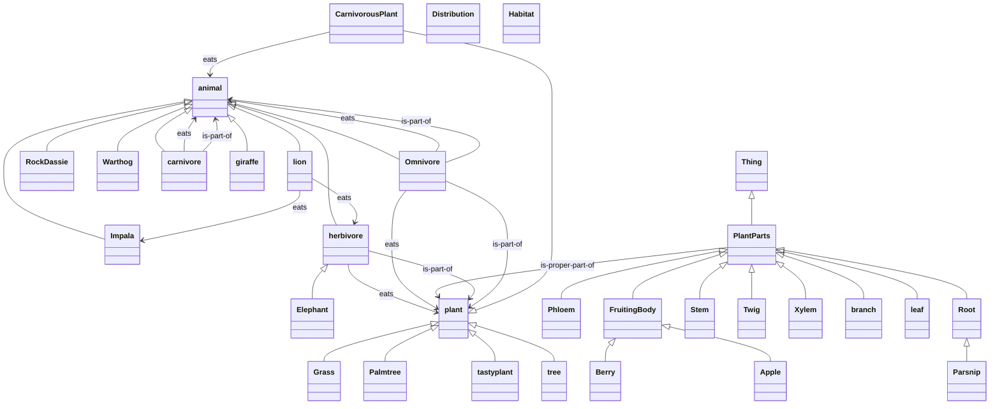

```mermaid
classDiagram
    class Berry {
    }
    class CarnivorousPlant {
    }
    class Elephant {
    }
    class FruitingBody {
    }
    class Grass {
    }
    class Impala {
    }
    class Omnivore {
    }
    class Palmtree {
    }
    class Phloem {
    }
    class PlantParts {
    }
    class RockDassie {
    }
    class Root {
    }
    class Stem {
    }
    class Twig {
    }
    class Warthog {
    }
    class Xylem {
    }
    class animal {
    }
    class branch {
    }
    class carnivore {
    }
    class giraffe {
    }
    class herbivore {
    }
    class leaf {
    }
    class lion {
    }
    class plant {
    }
    class tastyplant {
    }
    class tree {
    }
    class Thing {
    }
    class Apple {
    }
    class Distribution {
    }
    class Habitat {
    }
    class Parsnip {
    }

    %% SubClassOf
    FruitingBody <|-- Berry
    FruitingBody <|-- Apple
    plant <|-- CarnivorousPlant
    plant <|-- Grass
    plant <|-- Palmtree
    plant <|-- tastyplant
    plant <|-- tree
    herbivore <|-- Elephant
    PlantParts <|-- FruitingBody
    PlantParts <|-- Phloem
    PlantParts <|-- Root
    PlantParts <|-- Stem
    PlantParts <|-- Twig
    PlantParts <|-- Xylem
    PlantParts <|-- branch
    PlantParts <|-- leaf
    animal <|-- Impala
    animal <|-- Omnivore
    animal <|-- RockDassie
    animal <|-- Warthog
    animal <|-- carnivore
    animal <|-- giraffe
    animal <|-- herbivore
    animal <|-- lion
    Thing <|-- PlantParts
    Root <|-- Parsnip

    %% eats
    carnivore --> animal : eats
    herbivore --> plant : eats
    Omnivore --> animal : eats
    Omnivore --> plant : eats
    lion --> herbivore : eats
    lion --> Impala : eats
    CarnivorousPlant --> animal : eats

    %% is-part-of / is-proper-part-of
    PlantParts --> plant : is-proper-part-of
    herbivore --> plant : is-part-of
    carnivore --> animal : is-part-of
    Omnivore --> animal : is-part-of
    Omnivore --> plant : is-part-of
```

```

```
