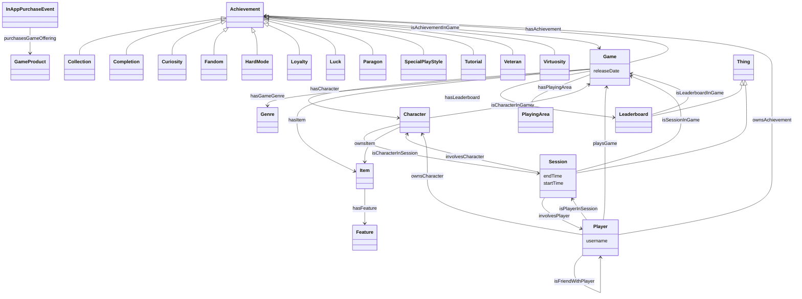

```mermaid
	classDiagram

    
    class Achievement {
    
    }

    class Character {
    
    }

    class Collection {
    
    }

    class Completion {
    
    }

    class Curiosity {
    
    }

    class Fandom {
    
    }

    class Feature {
    
    }

    class Game {
    
    }

    class GameProduct {
    
    }

    class Genre {
    
    }

    class HardMode {
    
    }

    class InAppPurchaseEvent {
    
    }

    class Item {
    
    }

    class Leaderboard {
    
    }

    class Loyalty {
    
    }

    class Luck {
    
    }

    class Paragon {
    
    }

    class Player {
    
    }

    class PlayingArea {
    
    }

    class Session {
    
    }

    class SpecialPlayStyle {
    
    }

    class Tutorial {
    
    }

    class Veteran {
    
    }

    class Virtuosity {
    
    }

    class Thing {
    
    }


    
    Achievement <|-- Collection 
    
    Achievement <|-- Completion 
    
    Achievement <|-- Curiosity 
    
    Achievement <|-- Fandom 
    
    Achievement <|-- HardMode 
    
    Achievement <|-- Loyalty 
    
    Achievement <|-- Luck 
    
    Achievement <|-- Paragon 
    
    Achievement <|-- SpecialPlayStyle 
    
    Achievement <|-- Tutorial 
    
    Achievement <|-- Veteran 
    
    Achievement <|-- Virtuosity 
    
    Thing <|-- Leaderboard 
    
    Thing <|-- Session 
    

Game  --> Achievement   :hasAchievement  

Game  --> Character   :hasCharacter  

Item  --> Feature   :hasFeature  

Game  --> Genre   :hasGameGenre  

Game  --> Item   :hasItem  

Game  --> Leaderboard   :hasLeaderboard  

Game  --> PlayingArea   :hasPlayingArea  

Session  --> Character   :involvesCharacter  

Session  --> Player   :involvesPlayer  

Achievement  --> Game   :isAchievementInGame  

Character  --> Game   :isCharacterInGame  

Character  --> Session   :isCharacterInSession  

Player  --> Player   :isFriendWithPlayer  

Leaderboard  --> Game   :isLeaderboardInGame  

Player  --> Session   :isPlayerInSession  

Session  --> Game   :isSessionInGame  

Player  --> Achievement   :ownsAchievement  

Player  --> Character   :ownsCharacter  

Character  --> Item   :ownsItem  

Player  --> Game   :playsGame  

InAppPurchaseEvent  --> GameProduct   :purchasesGameOffering  

    
    class Session  {
    
    
        endTime  
     
        startTime  
     
    } 
    
    class Game  {
    
    
        releaseDate  
     
    } 
    
    class Player  {
    
    
        username  
     
    } 
    
```