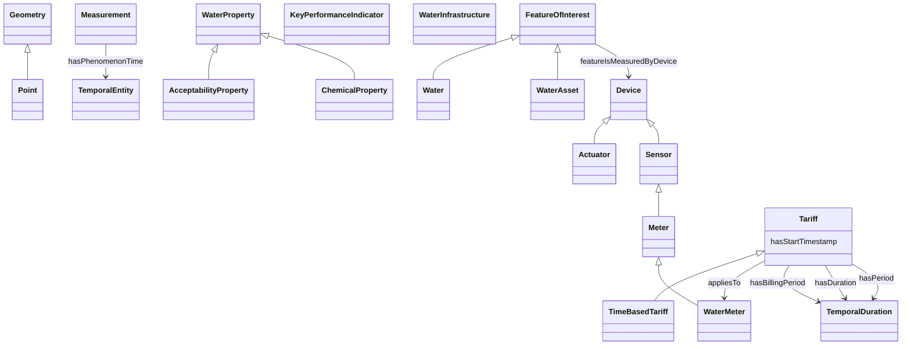

```mermaid
	classDiagram

    
    class Geometry {
    
    }

    class Point {
    
    }

    class TemporalDuration {
    
    }

    class TemporalEntity {
    
    }

    class Actuator {
    
    }

    class Device {
    
    }

    class FeatureOfInterest {
    
    }

    class Measurement {
    
    }

    class Meter {
    
    }

    class Sensor {
    
    }

    class KeyPerformanceIndicator {
    
    }

    class AcceptabilityProperty {
    
    }

    class ChemicalProperty {
    
    }

    class Tariff {
    
    }

    class TimeBasedTariff {
    
    }

    class Water {
    
    }

    class WaterAsset {
    
    }

    class WaterInfrastructure {
    
    }

    class WaterMeter {
    
    }

    class WaterProperty {
    
    }


    
    Geometry <|-- Point 
    
    Device <|-- Actuator 
    
    Device <|-- Sensor 
    
    Sensor <|-- Meter 
    
    WaterProperty <|-- AcceptabilityProperty 
    
    WaterProperty <|-- ChemicalProperty 
    
    Tariff <|-- TimeBasedTariff 
    
    FeatureOfInterest <|-- Water 
    
    FeatureOfInterest <|-- WaterAsset 
    
    Meter <|-- WaterMeter 
    

Tariff  --> WaterMeter   :appliesTo  

FeatureOfInterest  --> Device   :featureIsMeasuredByDevice  

Tariff  --> TemporalDuration   :hasBillingPeriod  

Tariff  --> TemporalDuration   :hasDuration  

Tariff  --> TemporalDuration   :hasPeriod  

Measurement  --> TemporalEntity   :hasPhenomenonTime  

    
    class Tariff  {
    
    
        hasStartTimestamp  
     
    } 
    
```