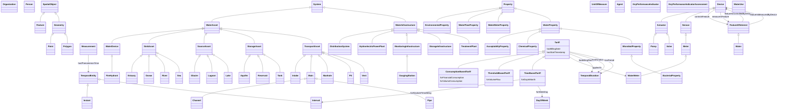

```mermaid
	classDiagram

    
    class Organization {
    
    }

    class Person {
    
    }

    class Feature {
    
    }

    class Geometry {
    
    }

    class SpatialObject {
    
    }

    class Point {
    
    }

    class Polygon {
    
    }

    class DayOfWeek {
    
    }

    class Instant {
    
    }

    class Interval {
    
    }

    class TemporalDuration {
    
    }

    class TemporalEntity {
    
    }

    class Actuator {
    
    }

    class Device {
    
    }

    class FeatureOfInterest {
    
    }

    class Measurement {
    
    }

    class Meter {
    
    }

    class Property {
    
    }

    class Sensor {
    
    }

    class UnitOfMeasure {
    
    }

    class Agent {
    
    }

    class KeyPerformanceIndicator {
    
    }

    class KeyPerformanceIndicatorAssessment {
    
    }

    class System {
    
    }

    class AcceptabilityProperty {
    
    }

    class Aquifer {
    
    }

    class BacterialProperty {
    
    }

    class Channel {
    
    }

    class ChemicalProperty {
    
    }

    class ConsumptionBasedTariff {
    
    }

    class DistributionSystem {
    
    }

    class EnvironmentalProperty {
    
    }

    class Estuary {
    
    }

    class FireHydrant {
    
    }

    class GaugingStation {
    
    }

    class Glacier {
    
    }

    class HydroelectricPowerPlant {
    
    }

    class Intake {
    
    }

    class Lagoon {
    
    }

    class Lake {
    
    }

    class Main {
    
    }

    class Manhole {
    
    }

    class MicrobialProperty {
    
    }

    class MonitoringInfrastructure {
    
    }

    class Ocean {
    
    }

    class Pipe {
    
    }

    class Pit {
    
    }

    class Pump {
    
    }

    class Reservoir {
    
    }

    class River {
    
    }

    class Sea {
    
    }

    class SinkAsset {
    
    }

    class SourceAsset {
    
    }

    class StorageAsset {
    
    }

    class StorageInfrastructure {
    
    }

    class Tank {
    
    }

    class Tariff {
    
    }

    class ThresholdBasedTariff {
    
    }

    class TimeBasedTariff {
    
    }

    class TransportAsset {
    
    }

    class TreatmentPlant {
    
    }

    class Valve {
    
    }

    class Vent {
    
    }

    class Water {
    
    }

    class WaterAsset {
    
    }

    class WaterDevice {
    
    }

    class WaterFlowProperty {
    
    }

    class WaterInfrastructure {
    
    }

    class WaterMeter {
    
    }

    class WaterMeterProperty {
    
    }

    class WaterProperty {
    
    }

    class WaterUse {
    
    }


    
    SpatialObject <|-- Feature 
    
    SpatialObject <|-- Geometry 
    
    Geometry <|-- Point 
    
    Geometry <|-- Polygon 
    
    TemporalEntity <|-- Instant 
    
    TemporalEntity <|-- Interval 
    
    Device <|-- Actuator 
    
    Device <|-- Sensor 
    
    WaterAsset <|-- WaterDevice 
    
    Sensor <|-- Meter 
    
    WaterProperty <|-- AcceptabilityProperty 
    
    WaterProperty <|-- ChemicalProperty 
    
    WaterProperty <|-- MicrobialProperty 
    
    StorageAsset <|-- Aquifer 
    
    StorageAsset <|-- Reservoir 
    
    StorageAsset <|-- Tank 
    
    MicrobialProperty <|-- BacterialProperty 
    
    Main <|-- Channel 
    
    Main <|-- Pipe 
    
    Tariff <|-- ConsumptionBasedTariff 
    
    Tariff <|-- ThresholdBasedTariff 
    
    Tariff <|-- TimeBasedTariff 
    
    WaterInfrastructure <|-- DistributionSystem 
    
    WaterInfrastructure <|-- HydroelectricPowerPlant 
    
    WaterInfrastructure <|-- MonitoringInfrastructure 
    
    WaterInfrastructure <|-- StorageInfrastructure 
    
    WaterInfrastructure <|-- TreatmentPlant 
    
    Property <|-- EnvironmentalProperty 
    
    Property <|-- WaterFlowProperty 
    
    Property <|-- WaterMeterProperty 
    
    Property <|-- WaterProperty 
    
    SinkAsset <|-- Estuary 
    
    SinkAsset <|-- Ocean 
    
    SinkAsset <|-- River 
    
    SinkAsset <|-- Sea 
    
    WaterDevice <|-- FireHydrant 
    
    Actuator <|-- Pump 
    
    Actuator <|-- Valve 
    
    Meter <|-- WaterMeter 
    
    MonitoringInfrastructure <|-- GaugingStation 
    
    SourceAsset <|-- Glacier 
    
    SourceAsset <|-- Lagoon 
    
    SourceAsset <|-- Lake 
    
    TransportAsset <|-- Intake 
    
    TransportAsset <|-- Main 
    
    TransportAsset <|-- Manhole 
    
    TransportAsset <|-- Pit 
    
    TransportAsset <|-- Vent 
    
    WaterAsset <|-- SinkAsset 
    
    WaterAsset <|-- SourceAsset 
    
    WaterAsset <|-- StorageAsset 
    
    WaterAsset <|-- TransportAsset 
    
    FeatureOfInterest <|-- Water 
    
    System <|-- WaterAsset 
    
    System <|-- WaterInfrastructure 
    

Tariff  --> WaterMeter   :appliesTo  

Device  --> FeatureOfInterest   :controlsFeature  

FeatureOfInterest  --> Device   :featureIsControlledByDevice  

FeatureOfInterest  --> Device   :featureIsMeasuredByDevice  

TimeBasedTariff  --> Interval   :forAbsoluteTimeAtDay  

TimeBasedTariff  --> DayOfWeek   :forWeekDay  

Tariff  --> TemporalDuration   :hasBillingPeriod  

Tariff  --> TemporalDuration   :hasDuration  

Tariff  --> TemporalDuration   :hasPeriod  

Measurement  --> TemporalEntity   :hasPhenomenonTime  

Device  --> FeatureOfInterest   :measuresFeature  

    
    class TimeBasedTariff  {
    
    
        forDayInMonth  
     
    } 
    
    class ConsumptionBasedTariff  {
    
    
        forFinancialConsumption  
     
        forVolumeConsumption  
     
    } 
    
    class ThresholdBasedTariff  {
    
    
        forVolumeFlow  
     
    } 
    
    class Tariff  {
    
    
        hasBillingDate  
     
        hasStartTimestamp  
     
    } 
    
```